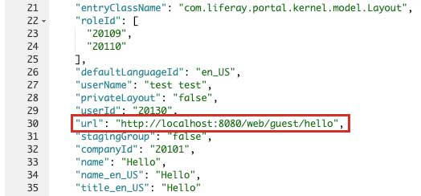

## Layout URL Indexer

An `IndexerPostProcessor` component for `com.liferay.portal.kernel.model.Layout` to add a field `url` to the indexed document.

## Expected result (example)

## License
[MIT](LICENSE)
